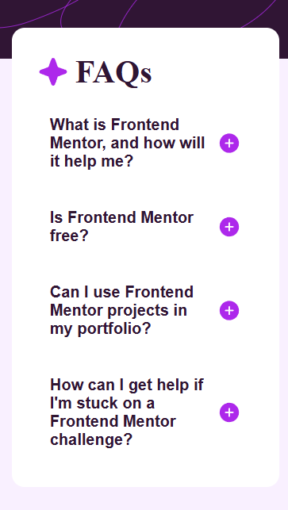

<h1 align="center"> Frontend Mentor - Solução de FAQ Accordion</h1>

Essa é uma solução para o [Desafio Dashboard de FAQ Accordion](https://www.frontendmentor.io/challenges/faq-accordion-wyfFdeBwBz). Os desafios do Frontend Mentor ajudam você a aprimorar suas habilidades de programação por meio da criação de projetos realistas.

    

## 💻 Projeto

Este projeto é um FAQ (Perguntas Frequentes) sobre o Frontend Mentor. Nele, é possível alternar entre visualizar a pergunta e a resposta. Também é possível fazer isso via teclado.

## 🚀 Tecnologias

Esse projeto foi desenvolvido com as seguintes tecnologias:

- HTML
- CSS
- JavaScript
- Git e GitHub

### O Que Aprendi

- Acessibilidade, ao fazer com que o faq seja acessível via apenas teclado.
- Operadores Ternários em JavaScript

### Links
- Acesse a URL da solução [clicando aqui](https://github.com/Antonio-Rafael-Silva/faq-accordion)
- Acesse o site do projeto [clicando aqui](https://antonio-rafael-silva.github.io/faq-accordion/)

## Screenshot do resultado

### Versão Desktop

 
    

### Versão Mobile

 
    

## Autor 

- Website - [Antônio Rafael](https://github.com/Antonio-Rafael-Silva/faq-accordion)
- Frontend Mentor - [@Antonio-Rafael-Silva](https://www.frontendmentor.io/profile/Antonio-Rafael-Silva)
- Linkedin - [Antônio Rafael](https://www.linkedin.com/in/ant%C3%B4nio-rafael-01131b372/)